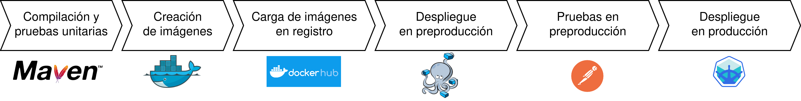

En este repositorio se encuentran todos los códigos realizados durante el Trabajo Fin de Máster titulado *Diseño e implementación de un sistema antifraude en redes de telecomunicación basado en la especificación de API Open Gateway*.

# Open Gateway

Open Gateway es un proyecto es un proyecto que va a permitir a las operadoras de telecomunicaciones, exponer sus capacidades de forma estandarizada a terceros a través de APIs. Durante este trabajo, se van a desarrollar tres de las API de Open Gateway. Concretamente, Sim Swap (v 0.4.0), Device Status (v 0.4.1) y Know Your Customer (v 0.1.0). Las definiciones de estas API se pueden encontrar en el repositorio oficial de CAMARA.

# Arquitectura de la solución de API Open Gateway

El desarrollo cuenta no solo con las API propiamente dichas sino que también con plataformas que permiten la monitorización de métricas, centralización de logs, control de acceso y un punto único de entrada mediante un API GW. Esto va aEl objetivo es conocer quién accede a los servicios, cuál es el comportamiento y el rendimiento de los mismos y mejorar la gestión de las API. La arquitectura de la solución es la siguiente:

Como se puede ver, se despliega una base de clientes de Mongo que contiene toda la información necesaria para exponer las API de Open Gateway. Se supone que la información de esta base es actualizada desde una operadora de telecomunicaciones. La base cuenta con una información inicial de 100 clientes ficticios. Las API se han desarrollado con Spring Boot y la montirozación de métricas se implementa con Grafana y Prometheus. Para la centralización de los logs de todos los microservicios se ha utilizado ELK y para el servidor de autorización keycloak. En cuanto al API GW se usa Kong y Konga para gestionarlo. Se implementa también una web para la gestión de la base de clientes y para tener un entorno gráfico de pruebas de las API. 

# Despliegue de la solución de API Open Gateway

La solución se puede desplegar a través de Docker Compose o de Kubernetes. La siguiente tabla muestra un resumen de los pods desplegados y de los puertos que exponen:

| Pod          | Puerto | Descripción                                                                                             |
|--------------|--------|---------------------------------------------------------------------------------------------------------|
| Provisión    | 8082   | El Pod incluye el API de provisión y Filebeat para el streaming de logs.                                |
| Sim Swap     | 8083   | El Pod incluye el API de Sim Swap y Filebeat para el streaming de logs.                                 |
| Device Status| 8084   | El Pod incluye el API de Device Status y Filebeat para el streaming de logs.                            |
| KYC          | 8085   | El Pod incluye el API de KYC y Filebeat para el streaming de logs.                                      |
| Web          | 80     | Portal web para administración de clientes y pruebas de API.                                            |
| Mongodb      | 27017  | Base de datos con la información de clientes para Open Gateway. Si el cuerpo esta vacío no hay modificación. |
| Kong         | 8100   | API GW como punto de acceso único a las API.                                                            |
| Kong-db      | 5432   | Base de Postgresql que usa Kong para almacenar la información.                                          |
| Konga        | 1337   | Portal Web para la gestión del API GW.                                                                  |
| Konga-db     | 5432   | Base de Postgresql que usa Konga para almacenar la información.                                         |
| Keycloak     | 8080   | Servidor de autorización para habilitar la entrada a las API mediante token de acceso.                  |
| Keycloak-db  | 5432   | Base de Postgresql que usa Konga para almacenar la información.                                         |
| Redis        | 6379   | Base de datos para almacenar la información de MCC y el país asociado.                                  |
| Logstash     | 5000   | Herramienta para la centralización y formateo de los logs de las API.                                   |
| Elasticsearch| 9200   | Herramienta para el almacenamiento de las API.                                                          |
| Kibana       | 5601   | Herramienta para la visualización de los logs de las API.                                               |
| Prometheus   | 9090   | Herramienta para el almacenamiento de las métricas de las API.                                          |
| Grafana      | 3000   | Herramienta para la visualización de las métricas de las API.                                           |

Aunque la solución se puede desplegar en cualquier entorno, en este trabajo se ha usado una VM con Minikube. Se ha creado un pipeline de Jenkins para automatizar el flujo de pruebas y despliegue de la arquitectura. Se utiliza Docker Compose como entorno de pruebas y Kubernetes como entorno productivo. El pipeline es el siguiente:

# Aplicación Sandbank

Además del entorno de microservicios, se ha realizado una aplicación Android llamada Sandbank. La aplicación se asemeja a una aplicación de una entidad bancaria donde el usuario puede crearse una cuenta, modificar sus datos personales y hacer transferencias. Se usarán las API de Open Gateway Sim Swap y Know Your Customer para evitar registros con datos incorrectos y transferencias fraudulentas. La aplicación bloquea los registros de los usuarios que estén introduciendo datos que no coinciden con los que devuelve el API de Know Your Customer. Por otro lado, bloquea las transferencias que superen el 90% del dinero disponible y cuyo usuario haya cambiado de Sim recientemente (En las últimas 24 horas). La aplicación tiene en cuenta que las API están desplegadas en una cierta IP, para usarla en el entorno deseado se debe modificar la IP a la que apunta la aplicación.

# Estructura de carpetas

En esta sección se detalla que se puede encontrar en cada una de las carpetas relativas al proyecto. El código de cada una de las API se puede encontrar en los directorios que tienen el nombre de cada una de las API. 
